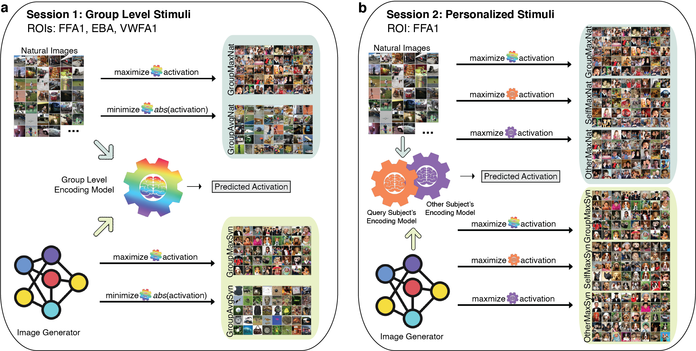

# neural-modulation
Code for preprint [Modulating human brain responses via optimal natural image selection and synthetic image generation](https://arxiv.org/abs/2304.09225). 

In this work, we performed human brain response modulation on both group level and individual level with two fMRI studies, as shown in the below figure.



## How to
To generate synthetic images, there are some necessary stuff to run the code:
1. Install BigGAN (the one we used) `pip install pytorch-pretrained-biggan`. Other SOTA generative AI models can be a good replacement for BigGAN.
2. Download the `src` folder [here](https://github.com/zijin-gu/NeuroGen/tree/main/src).
3. Pretrained fwRF encoding model parameters for 8 NSD subjects can be found [here](https://github.com/zijin-gu/NeuroGen/tree/main/output). Linear weights for NeuroGen subjects are inside `linearparams`.

`synthesize.py` is the script to generate "Max" or "Avg" images. If generating group level images, output predicted brain activation is the averaged activation from 8 NSD encoding model outputs; if individual level, then the linear ensemble method can be used where the linear weights are needed.


## Citation
Please cite the following work if you find this topic inspires your work.
The preprint for the fMRI experiments:
```
@article{gu2023modulating,
  title={Modulating human brain responses via optimal natural image selection and synthetic image generation},
  author={Gu, Zijin and Jamison, Keith and Sabuncu, Mert R and Kuceyeski, Amy},
  journal={arXiv preprint arXiv:2304.09225},
  year={2023}
}
```
The work for personalized encoding model construction:
```
@article{gu2022personalized,
  title={Personalized visual encoding model construction with small data},
  author={Gu, Zijin and Jamison, Keith and Sabuncu, Mert and Kuceyeski, Amy},
  journal={Communications Biology},
  volume={5},
  number={1},
  pages={1382},
  year={2022},
  publisher={Nature Publishing Group UK London}
}
```
The work for introducing NeuroGen:
```
@article{gu2022neurogen,
  title={NeuroGen: activation optimized image synthesis for discovery neuroscience},
  author={Gu, Zijin and Jamison, Keith Wakefield and Khosla, Meenakshi and Allen, Emily J and Wu, Yihan and Naselaris, Thomas and Kay, Kendrick and Sabuncu, Mert R and Kuceyeski, Amy},
  journal={NeuroImage},
  volume={247},
  pages={118812},
  year={2022},
  publisher={Elsevier}
}
```
